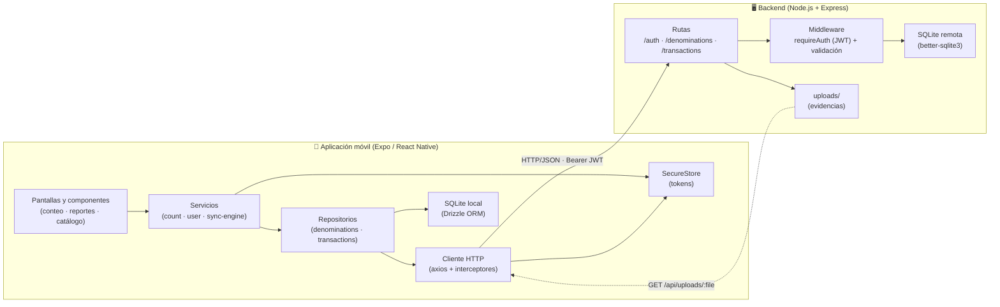
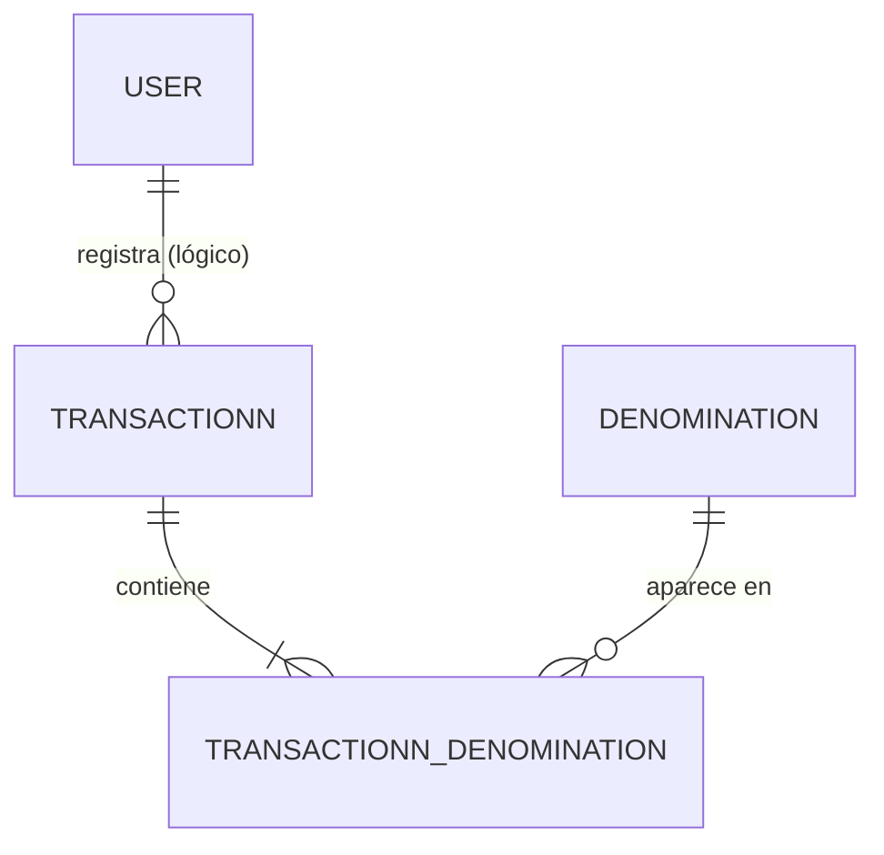
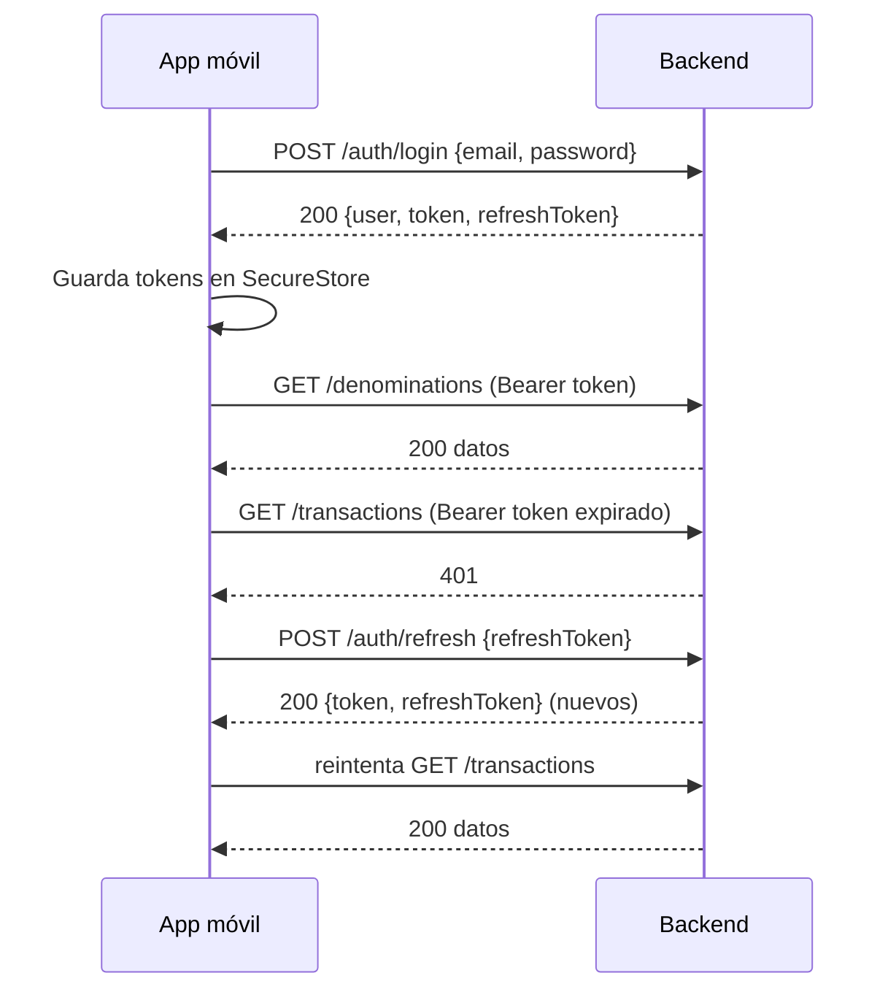
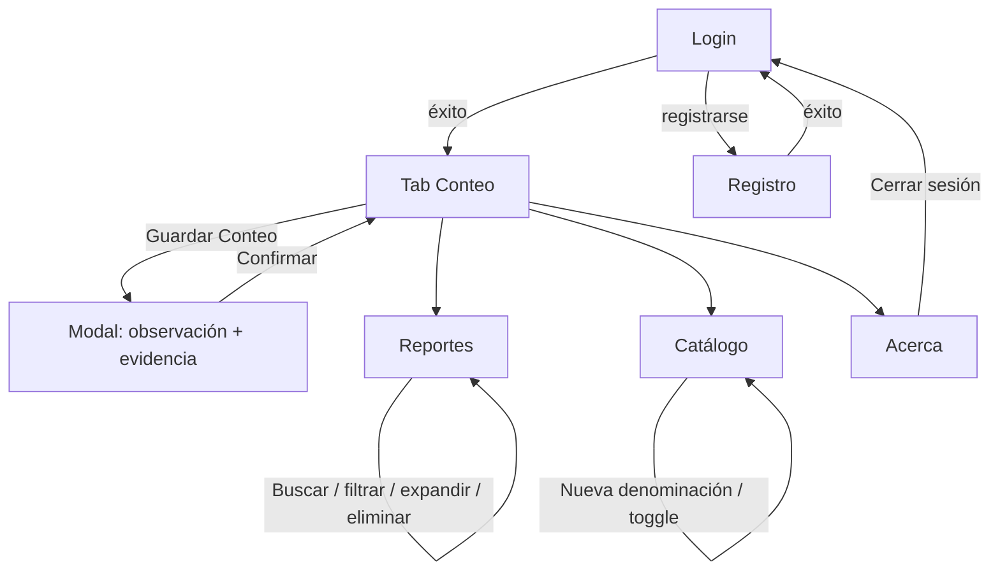
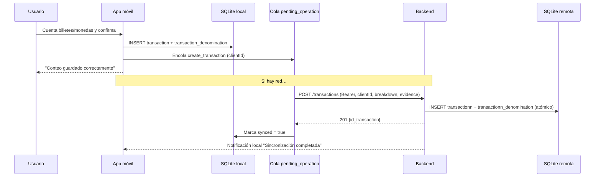

# EasyCount — Documento Técnico del Proyecto

**Proyecto:** EasyCount — Aplicación móvil para el conteo de dinero físico y cierre de caja
**Autor:** Felix Jiménez (`fr.jimenezv@uea.edu.ec`)
**Institución:** UEA
**Plataforma objetivo:** Android (APK) · iOS (soporte de código)
**Versión del documento:** 1.0 · Octubre 2026

---

## Índice

1. [Definición de la idea de aplicación móvil](#1-definición-de-la-idea-de-aplicación-móvil)
2. [Análisis de requerimientos](#2-análisis-de-requerimientos)
3. [Diseño de la arquitectura de la solución](#3-diseño-de-la-arquitectura-de-la-solución)
4. [Diseño de la base de datos normalizada](#4-diseño-de-la-base-de-datos-normalizada)
5. [Modelado de entidades](#5-modelado-de-entidades)
6. [Construcción del backend](#6-construcción-del-backend)
7. [Implementación de operaciones CRUD](#7-implementación-de-operaciones-crud)
8. [Documentación de APIs](#8-documentación-de-apis)
9. [Implementación de autenticación y autorización](#9-implementación-de-autenticación-y-autorización)
10. [Aplicación de métodos de optimización](#10-aplicación-de-métodos-de-optimización)
11. [Diseño de interfaces de la aplicación móvil](#11-diseño-de-interfaces-de-la-aplicación-móvil)
12. [Desarrollo de la aplicación móvil](#12-desarrollo-de-la-aplicación-móvil)
13. [Conexión de la aplicación móvil con el backend](#13-conexión-de-la-aplicación-móvil-con-el-backend)
14. [Validación del flujo de datos](#14-validación-del-flujo-de-datos)
15. [Pruebas funcionales e integración](#15-pruebas-funcionales-e-integración)
16. [Documentación técnica del proyecto](#16-documentación-técnica-del-proyecto)

---

## 1. Definición de la idea de aplicación móvil

### 1.1 Necesidad / problema

En tiendas, cafeterías, farmacias y negocios pequeños de Ecuador el **cierre de caja** se hace a mano: se cuentan billetes y monedas, se multiplica cada denominación por su cantidad y se suma todo con calculadora. Este proceso es **lento, propenso a errores aritméticos y no deja evidencia** del estado real de la caja al cierre. Además, los cierres se anotan en cuadernos o notas sueltas, lo que dificulta **consultar el historial**, comparar días y auditar diferencias.

### 1.2 Propósito de la aplicación

**EasyCount** automatiza el conteo de dinero físico y el registro del cierre de caja. La persona ingresa cuántos billetes y monedas tiene de cada denominación, la app calcula el total en tiempo real y guarda el cierre con observación y, opcionalmente, una **foto de respaldo** (recibo o arqueo). La aplicación funciona **sin conexión** (offline-first) y sincroniza los datos con un backend propio cuando recupera la red.

### 1.3 Usuarios principales

| Usuario | Descripción | Necesidad principal |
| --- | --- | --- |
| **Cajero / responsable de caja** | Persona que cierra caja al final del turno o del día. | Contar rápido, calcular el total sin errores y dejar constancia del cierre. |
| **Dueño / administrador del negocio** | Supervisa los cierres y detecta diferencias. | Consultar el historial, filtrar por fecha y ver evidencias fotográficas. |
| **Auditor interno** | Revisa arqueos. | Trazabilidad: quién, cuándo, cuánto y con qué respaldo. |

### 1.4 Funcionalidades requeridas

- **Registro e inicio de sesión** de usuarios (autenticación con correo y contraseña).
- **Conteo de caja**: lista de billetes y monedas de Ecuador con botones `+` / `−` y entrada directa de cantidad; **total en tiempo real**.
- **Guardado del cierre** con observación opcional y **foto de respaldo** opcional (cámara o galería).
- **Catálogo de denominaciones**: consultar, **crear** y **activar/desactivar** denominaciones (billetes y monedas).
- **Historial de cierres**: listar, **buscar por texto**, **filtrar por rango de fechas** (con presets Hoy / 7 días / 30 días / Todo), expandir el desglose y **eliminar** registros.
- **Modo offline-first**: guardar y consultar sin conexión; **cola de salida** con reintentos y sincronización automática al recuperar la red.
- **Notificación local** cuando los cierres pendientes se sincronizan.
- **Gestión de permisos nativos** (cámara y notificaciones) en el momento de uso, con degradación controlada.

### 1.5 Datos gestionados

- **Usuarios**: nombre de usuario, correo, contraseña (hash), fechas de creación/actualización.
- **Denominaciones**: valor monetario, tipo (Billete/Moneda), estado activo.
- **Cierres / transacciones**: fecha, total, observación, evidencia fotográfica, identificador de cliente.
- **Desglose del cierre**: denominación, cantidad, subtotal.
- **Metadatos de sincronización**: cola de operaciones pendientes, reintentos y última fecha de sincronización.

---

## 2. Análisis de requerimientos

### 2.1 Requerimientos funcionales

| ID | Requerimiento | Descripción |
| --- | --- | --- |
| **RF-01** | Registro de usuario | El sistema permite crear una cuenta con usuario, correo y contraseña (mínimo 6 caracteres). |
| **RF-02** | Inicio de sesión | El sistema autentica al usuario con correo y contraseña y devuelve un token JWT. |
| **RF-03** | Renovación de sesión | El sistema renueva el token de acceso mediante un *refresh token* sin pedir credenciales de nuevo. |
| **RF-04** | Cierre de sesión | El usuario puede cerrar sesión; se limpian tokens y datos locales. |
| **RF-05** | Consultar denominaciones | La app lista las denominaciones ordenadas por tipo y valor. |
| **RF-06** | Crear denominación | El usuario puede añadir una denominación (valor > 0 y tipo Billete/Moneda). |
| **RF-07** | Activar/desactivar denominación | El usuario puede cambiar el estado `active` de una denominación. |
| **RF-08** | Contar dinero | El usuario ingresa cantidades por denominación; el total se calcula en tiempo real. |
| **RF-09** | Guardar cierre | Se registra el cierre con total, observación, desglose y evidencia opcional. |
| **RF-10** | Adjuntar evidencia | El usuario puede tomar una foto o elegir una de la galería como respaldo del cierre. |
| **RF-11** | Consultar historial | La app lista los cierres con su desglose y evidencia. |
| **RF-12** | Filtrar historial | El usuario puede buscar por texto y filtrar por rango de fechas. |
| **RF-13** | Eliminar cierre | El usuario puede eliminar un cierre (local y remotamente si ya se sincronizó). |
| **RF-14** | Sincronización offline | Las operaciones se encolan y sincronizan al recuperar la red, con reintentos. |
| **RF-15** | Notificar sincronización | Se emite una notificación local al completar la sincronización de cierres. |
| **RF-16** | Idempotencia | Reenviar un cierre con el mismo `clientId` no duplica el registro en el servidor. |

### 2.2 Requerimientos no funcionales

| ID | Categoría | Requerimiento |
| --- | --- | --- |
| **RNF-01** | **Seguridad** | Contraseñas almacenadas con hash **bcrypt** (10 rondas); nunca en texto plano. |
| **RNF-02** | **Seguridad** | Comunicación con el backend mediante `Authorization: Bearer <JWT>`; endpoints de datos protegidos. |
| **RNF-03** | **Seguridad** | Tokens persistidos en **SecureStore** (almacenamiento cifrado del dispositivo). |
| **RNF-04** | **Seguridad** | En producción la URL de la API debe ser **HTTPS** (validado en arranque; HTTP solo con flag explícito de demo). |
| **RNF-05** | **Rendimiento** | Caché en memoria (cache-aside) para el catálogo; *batch insert* para el desglose; total en tiempo real sin recálculos costosos. |
| **RNF-06** | **Rendimiento** | Índices en `transaction.synced`, `pending_operation.next_retry_at` y `transactionn.client_id`. |
| **RNF-07** | **Disponibilidad** | Funcionamiento **offline-first**: la app opera 100 % sin conexión y sincroniza después. |
| **RNF-08** | **Disponibilidad** | Reintentos con **backoff exponencial** (1 s → 30 s, máximo 5 intentos) y recuperación de operaciones agotadas. |
| **RNF-09** | **Usabilidad** | Interfaz en español, navegación por pestañas, validaciones en formularios, *toasts* y estados vacíos claros. |
| **RNF-10** | **Accesibilidad** | Componentes táctiles con tamaño adecuado, etiquetas legibles, contraste alto (tema oscuro) y textos de permiso explicativos. |
| **RNF-11** | **Mantenibilidad** | Separación por capas (UI → servicios → repositorios → fuentes remotas/locales); contratos validados con **Zod**. |
| **RNF-12** | **Integridad** | Claves foráneas activas (`PRAGMA foreign_keys = ON`) y borrado en cascada del desglose. |
| **RNF-13** | **Portabilidad** | Android e iOS con **Expo SDK 54**; un único cliente HTTP multiplataforma (axios). |

---

## 3. Diseño de la arquitectura de la solución

### 3.1 Componentes principales

| Componente | Tecnología | Responsabilidad |
| --- | --- | --- |
| **Aplicación móvil** | React Native + Expo SDK 54, expo-router, NativeWind | Interfaz, captura de datos, estado, almacenamiento local, cola de sincronización. |
| **Backend / API REST** | Node.js + Express 5 | Autenticación, reglas de negocio, validación, acceso a datos, servicio de archivos. |
| **Base de datos remota** | SQLite (`better-sqlite3`) | Fuente de verdad persistente en el servidor. |
| **Base de datos local** | SQLite (`expo-sqlite` + Drizzle ORM) | Caché y respaldo offline, cola de operaciones. |
| **Servicios externos** | *(ninguno en runtime)* | La app usa notificaciones **locales** (no push remoto). Para distribución se usa **EAS Build** (Expo Application Services). |

### 3.2 Diagrama de arquitectura



### 3.3 Flujo de información

1. **Escritura (offline-first).** La UI llama a un servicio (`CountService`). El repositorio **escribe primero en SQLite local** y **encola** la operación en `pending_operation`. Luego `SyncEngine.kick()` intenta enviarla al backend. Si no hay red, la operación queda pendiente y no se consumen intentos.
2. **Sincronización.** `SyncEngine` escucha los cambios de red (`expo-network`). Al recuperar conexión, procesa la cola en orden, aplica **backoff exponencial** y marca la operación como exitosa, fallida (reintento) o agotada.
3. **Lectura.** El repositorio intenta leer del **backend**; si tiene éxito, reemplaza la caché local y devuelve los datos. Si falla (sin red), devuelve los datos **locales**.
4. **Autenticación.** El cliente HTTP inyecta el token en cada petición; ante un `401` intenta renovar el token una sola vez (*single-flight*) y, si falla, notifica sesión expirada y redirige al login.
5. **Evidencias.** La foto se guarda localmente en `document/evidence/` y se envía en base64 dentro del `POST /transactions`; el backend la escribe en `backend/uploads/` y la sirve por HTTP.

---

## 4. Diseño de la base de datos normalizada

El sistema utiliza **dos bases de datos SQLite** con roles distintos:

- **BD remota (backend):** fuente de verdad, normalizada, compartida por todos los clientes.
- **BD local (app):** caché offline + cola de salida; incluye algunas redundancias controladas para funcionar sin red.

### 4.1 BD remota — `backend/easycount.db`

#### Tabla `user`

| Campo | Tipo | Restricción | Descripción |
| --- | --- | --- | --- |
| `id_user` | INTEGER | **PK**, AUTOINCREMENT | Identificador del usuario. |
| `username` | VARCHAR(100) | NOT NULL | Nombre de usuario. |
| `email` | VARCHAR(255) | NOT NULL, **UNIQUE** | Correo (usado para login). |
| `password` | VARCHAR(255) | NOT NULL | Hash bcrypt de la contraseña. |
| `created_at` | DATETIME | NOT NULL | Fecha de creación (ISO 8601). |
| `updated_at` | DATETIME | NOT NULL | Fecha de última actualización. |

#### Tabla `denomination`

| Campo | Tipo | Restricción | Descripción |
| --- | --- | --- | --- |
| `id_denomination` | INTEGER | **PK**, AUTOINCREMENT | Identificador de la denominación. |
| `value` | DECIMAL(10,2) | NOT NULL | Valor monetario (> 0). |
| `type` | VARCHAR(50) | NOT NULL | `Billete` o `Moneda`. |
| `active` | BOOLEAN | NOT NULL, DEFAULT 1 | Si participa en el conteo. |
| `updated_at` | DATETIME | NULL | Marca de tiempo para resolución de conflictos (LWW). |

#### Tabla `transactionn` (cierres de caja)

| Campo | Tipo | Restricción | Descripción |
| --- | --- | --- | --- |
| `id_transaction` | INTEGER | **PK**, AUTOINCREMENT | Identificador del cierre. |
| `date` | DATETIME | NOT NULL | Fecha/hora del cierre. |
| `total` | DECIMAL(10,2) | NOT NULL | Total contado. |
| `observation` | VARCHAR(255) | NULL | Observación opcional. |
| `client_id` | VARCHAR(255) | NULL, **UNIQUE** (`idx_transactionn_client_id`) | Identificador generado en el cliente para **idempotencia**. |
| `evidence_path` | VARCHAR(255) | NULL | Nombre del archivo de evidencia en `uploads/`. |

#### Tabla `transactionn_denomination` (desglose)

| Campo | Tipo | Restricción | Descripción |
| --- | --- | --- | --- |
| `id_transaction_denomination` | INTEGER | **PK**, AUTOINCREMENT | Identificador de la fila. |
| `id_transaction` | INTEGER | **FK** → `transactionn.id_transaction` ON DELETE CASCADE | Cierre al que pertenece. |
| `id_denomination` | INTEGER | **FK** → `denomination.id_denomination` ON DELETE CASCADE | Denominación contada. |
| `quantity` | INTEGER | NOT NULL | Cantidad contada. |
| `subtotal` | DECIMAL(10,2) | NOT NULL | `quantity × value` (redundancia controlada). |

#### Relaciones



- `transactionn 1 — N transactionn_denomination` (relación obligatoria: todo cierre tiene al menos un desglose).
- `denomination 1 — N transactionn_denomination`.
- `user` se relaciona de forma lógica con los cierres (la API actual no persiste `id_user` en `transactionn`; ver §9.4).

#### Índices y pragmas

| Índice / PRAGMA | Tabla | Motivo |
| --- | --- | --- |
| `idx_transactionn_client_id` (UNIQUE) | `transactionn` | Búsqueda por `clientId` para idempotencia y borrado. |
| `email` (UNIQUE, implícito) | `user` | Login y prevención de duplicados. |
| `journal_mode = WAL` | BD | Mejor concurrencia lectura/escritura. |
| `foreign_keys = ON` | BD | Integridad referencial y borrado en cascada. |

#### Semilla

En la primera ejecución se siembran las denominaciones de Ecuador si la tabla está vacía: monedas de `0.01, 0.05, 0.10, 0.25, 0.50, 1.00` y billetes de `1, 5, 10, 20, 50, 100`.

### 4.2 BD local — app móvil (`frontend/db/schema.ts`)

| Tabla | Campos clave | Rol |
| --- | --- | --- |
| `denomination` | `id_denomination` (PK), `value`, `type`, `active`, `updated_at` | Caché del catálogo. |
| `transaction` | `id_transaction` (PK), `client_id` (UNIQUE), `date`, `total`, `observation`, `evidence_uri`, `synced`, `created_at`; índice `transaction_synced_idx(synced)` | Cierres locales (sincronizados y pendientes). |
| `transaction_denomination` | `id_transaction_denomination` (PK), `id_transaction` (FK → `transaction`, CASCADE), `id_denomination`, `label`, `value`, `quantity`, `subtotal` | Desglose con **snapshot** de `label`/`value` para mostrar offline. |
| `pending_operation` | `id` (PK), `client_id` (UNIQUE), `type`, `payload`, `attempts`, `max_attempts`, `next_retry_at`, `created_at`, `updated_at`; índice `pending_operation_ready_idx(next_retry_at)` | **Cola de salida** de operaciones pendientes. |
| `sync_meta` | `key` (PK), `value` | Metadatos (p. ej. `last_sync_at`). |

**Diferencia deliberada:** en la BD local `transaction_denomination.id_denomination` **no** se declara como FK a `denomination`, porque el catálogo local se reemplaza por completo en cada sincronización (`replaceAll`) y el desglose conserva su propio `label`/`value`. Esto garantiza que el historial se vea correctamente aunque el catálogo cambie.

### 4.3 Normalización

**Primera Forma Normal (1FN):** todos los atributos son atómicos; no hay listas ni campos multivaluados (el desglose se resuelve en la tabla `transactionn_denomination`).

**Segunda Forma Normal (2FN):** en `transactionn_denomination` los atributos `quantity` y `subtotal` dependen de la **clave primaria completa** (`id_transaction_denomination`), no de una parte. No existen dependencias parciales.

**Tercera Forma Normal (3FN):** no hay dependencias transitivas. En `user`, `username`/`email`/`password` dependen solo de `id_user`. En `denomination`, `value`/`type`/`active` dependen solo de `id_denomination`. En `transactionn`, `date`/`total`/`observation` dependen solo de `id_transaction`.

**Redundancias controladas (desnormalización justificada):**

| Dato redundante | Dónde | Justificación |
| --- | --- | --- |
| `total` | `transactionn` | Se conserva para lectura directa del total sin sumar el desglose (rendimiento y consistencia histórica). |
| `subtotal` | `transactionn_denomination` | Evita recalcular `quantity × value` en cada consulta y preserva el valor del momento del cierre. |
| `label` / `value` | `transaction_denomination` (local) | Permite renderizar el historial sin conexión, aunque el catálogo remoto cambie. |
| `client_id` | `transaction` / `transactionn` | Identificador de idempotencia entre cliente y servidor. |

---

## 5. Modelado de entidades

Las entidades se modelan en tres planos coherentes: **base de datos**, **backend** y **dominio de la app** (validado con Zod).

| Entidad | Tabla (backend) | Tabla (local) | Modelo de dominio (Zod) | Uso en backend | Uso en la app |
| --- | --- | --- | --- | --- | --- |
| **Usuario** | `user` | *(no persistido; solo tokens en SecureStore)* | `UserSchema` (`id_user`, `username`, `email`, `created_at`) | `routes/auth.js` | `AuthRemote`, `UserService`, `AuthStore` |
| **Denominación** | `denomination` | `denomination` | `DenominationSchema` (`id_denomination`, `value`, `type`, `active`, `label`) | `routes/denominations.js` | `DenominationRepository`, `CatalogScreen`, `Home` |
| **Cierre / Transacción** | `transactionn` | `transaction` | `TransactionSchema` (`id_transaction`, `date`, `total`, `observation`, `evidence`, `breakdown`) | `routes/transactions.js` | `TransactionRepository`, `ReportScreen`, `Home` |
| **Desglose** | `transactionn_denomination` | `transaction_denomination` | `TransactionBreakdownSchema` / `TransactionItemSchema` | join en `GET /transactions` | render del desglose en Reportes |
| **Operación pendiente** | *(solo cliente)* | `pending_operation` | `PendingOperationType` | — | `OperationsRepo`, `SyncEngine` |
| **Metadatos de sincronización** | *(solo cliente)* | `sync_meta` | — | — | `SyncMetaRepo`, `getLastSyncAt()` |

**Coherencia funcional:**

- El modelo de **Denominación** alimenta el conteo (RF-08) y el catálogo (RF-05..07).
- El modelo de **Cierre + Desglose** alimenta el guardado (RF-09/10) y el historial (RF-11..13).
- El modelo de **Operación pendiente** sostiene la sincronización offline (RF-14).
- El modelo de **Usuario** sostiene la autenticación (RF-01..04).

**Mapeo entre planos:** el servidor devuelve `total_general` en `GET /transactions`, mientras el cliente envía `total` en `POST`; el campo `label` se **deriva** en el cliente (`$${value}`) y no se persiste en el backend. Los repositorios (`TransactionRepository`, `DenominationRepository`) encapsulan estos mapeos para que la UI no conozca las diferencias de nomenclatura.

---

## 6. Construcción del backend

### 6.1 Tecnologías

| Componente | Versión | Uso |
| --- | --- | --- |
| Node.js | v24.17.0 | Runtime (ES Modules). |
| Express | ^5.2.1 | Framework HTTP y enrutamiento. |
| better-sqlite3 | ^13.0.3 | Driver SQLite síncrono. |
| jsonwebtoken | ^9.0.3 | Firma y verificación de JWT. |
| bcryptjs | ^3.0.3 | Hash de contraseñas. |
| cors | ^2.8.6 | CORS global. |
| dotenv | ^17.4.2 | Variables de entorno. |

### 6.2 Organización del proyecto

```
backend/
├── src/
│   ├── index.js             # Punto de entrada: middlewares, montaje de rutas, health, static, arranque
│   ├── config.js            # Lectura de variables de entorno (PORT, HOST, JWT_SECRET, expiraciones)
│   ├── db.js                # Conexión SQLite, DDL (schema), migraciones ligeras y seed
│   ├── validation.js        # Helper de respuesta de error de validación (422)
│   ├── middleware/
│   │   └── auth.js          # signToken, signRefreshToken, verifyRefreshToken, requireAuth
│   └── routes/
│       ├── auth.js          # register, login, refresh, me
│       ├── denominations.js # listar, crear, activar/desactivar
│       └── transactions.js  # crear (con evidencia), listar, eliminar
├── uploads/                 # Evidencias fotográficas servidas por express.static
├── .env.example
└── package.json
```

### 6.3 Responsabilidad de cada componente

- **Rutas (`routes/`):** definen endpoints, leen `req.body`/`req.params`, aplican **validaciones** y construyen la respuesta. Actúan como controladores.
- **Middleware (`middleware/auth.js`):** `requireAuth` verifica el JWT y adjunta `req.user`; los helpers firman tokens de acceso y de refresco.
- **Acceso a datos:** consultas SQL preparadas con `better-sqlite3` directamente en las rutas (patrón controlador + repositorio ligero). Las escrituras compuestas usan **transacciones** (`db.transaction`).
- **Validación (`validation.js`):** devuelve `422` con un mapa de errores por campo.
- **Configuración (`config.js`):** centraliza las variables de entorno.
- **Persistencia (`db.js`):** DDL, migraciones ligeras idempotentes (`hasColumn`), activación de `WAL` y `foreign_keys`, y *seed* inicial.
- **Archivos estáticos:** `express.static(UPLOADS_DIR)` expone `/api/uploads`.

### 6.4 Middlewares globales

| Middleware | Configuración | Motivo |
| --- | --- | --- |
| `cors()` | Habilitado globalmente | Permitir consumo desde la app (orígenes móviles). |
| `express.json({ limit: "12mb" })` | 12 MB | La evidencia fotográfica viaja en base64 dentro del JSON. |
| Manejador 404 | `res.status(404).json({ message: "Ruta no encontrada." })` | Respuesta uniforme. |

### 6.5 Ejecución

```bash
cd backend
npm install
cp .env.example .env
npm start        # o npm run dev (--watch)
```

---

## 7. Implementación de operaciones CRUD

### 7.1 Matriz CRUD

| Entidad | Crear (C) | Leer (R) | Actualizar (U) | Eliminar (D) |
| --- | --- | --- | --- | --- |
| **Usuario** | `POST /api/auth/register` | `GET /api/auth/me` | — | — |
| **Denominación** | `POST /api/denominations` | `GET /api/denominations` | `PATCH /api/denominations/:id` (activo) | — (se desactiva en vez de borrar) |
| **Cierre** | `POST /api/transactions` | `GET /api/transactions` | — | `DELETE /api/transactions/:clientId` |

### 7.2 Validaciones y manejo de errores

**Registro (`POST /auth/register`)**
- `username`, `email`, `password` obligatorios.
- `password.length >= 6`.
- Correo duplicado → `409`.
- Errores de validación → `422 { message, errors }`.
- Éxito → `201 { user, token, refreshToken }`.

**Crear denominación (`POST /denominations`)**
- `value` debe ser `number > 0`.
- `type ∈ { "Billete", "Moneda" }`.
- Errores → `422`; éxito → `201`.

**Actualizar denominación (`PATCH /denominations/:id`)**
- `active` debe ser `boolean` → si no, `422`.
- Si `id` no existe → `404`.
- **Resolución de conflictos last-write-wins:** si llega `updatedAt` anterior o igual al guardado → `409` (el servidor conserva el valor más reciente).
- Éxito → `200` con la denominación actualizada.

**Crear cierre (`POST /transactions`)**
- `total` debe ser `number`; `breakdown` debe ser `Array` → si no, `422`.
- **Idempotencia:** si `clientId` ya existe → `200 { ..., duplicated: true }` (no duplica).
- Evidencia: si supera el tope (`> 8 MB` base64) o es inválida → `422`.
- Inserción atómica del cierre + desglose dentro de una **transacción SQL**.
- Éxito → `201 { id_transaction, total, observation }`.

**Eliminar cierre (`DELETE /transactions/:clientId`)**
- **Idempotente:** si no existe → `200 { deleted: false }`; si existe → borra desglose y cierre, elimina el archivo de evidencia y devuelve `200 { deleted: true }`.

### 7.3 Estructura uniforme de respuestas

```jsonc
// Éxito
{ "id_transaction": 42, "total": 123.50, "observation": "Cierre matutino" }

// Error de validación (422)
{ "message": "Datos inválidos.", "errors": { "password": "La contraseña debe tener al menos 6 caracteres." } }

// Error de negocio
{ "message": "El correo ya está registrado." }
```

---

## 8. Documentación de APIs

- **Base URL (dev):** `http://<IP-del-PC>:4000/api`
- **Autenticación:** header `Authorization: Bearer <accessToken>` en los endpoints protegidos.
- **Formato:** JSON (`Content-Type: application/json`).

### 8.1 Resumen de endpoints

| Método | Ruta | Auth | Descripción |
| --- | --- | --- | --- |
| GET | `/api/health` | No | Estado del servicio. |
| POST | `/api/auth/register` | No | Registro de usuario. |
| POST | `/api/auth/login` | No | Login; devuelve tokens. |
| POST | `/api/auth/refresh` | No | Renueva el token de acceso. |
| GET | `/api/auth/me` | Sí | Usuario autenticado. |
| GET | `/api/denominations` | Sí | Lista denominaciones. |
| POST | `/api/denominations` | Sí | Crea denominación. |
| PATCH | `/api/denominations/:id` | Sí | Activa/desactiva denominación. |
| GET | `/api/transactions` | Sí | Historial (filas planas con desglose). |
| POST | `/api/transactions` | Sí | Guarda un cierre (+ evidencia). |
| DELETE | `/api/transactions/:clientId` | Sí | Elimina un cierre por `clientId`. |
| GET | `/api/uploads/:file` | No | Sirve una evidencia fotográfica. |

---

### 8.2 `GET /api/health`

- **Auth:** no.
- **Parámetros:** ninguno.
- **Respuesta 200:**
```json
{ "status": "ok", "service": "easycount-api", "timestamp": "2026-10-04T15:00:00.000Z" }
```

### 8.3 `POST /api/auth/register`

- **Auth:** no.
- **Cuerpo:**
```json
{ "username": "felix", "email": "felix@test.com", "password": "123456" }
```
- **Restricciones:** `password` mínimo 6 caracteres; `email` único.
- **Respuestas:**
  - `201` → `{ user: { id_user, username, email, created_at }, token, refreshToken }`
  - `409` → `{ "message": "El correo ya está registrado." }`
  - `422` → `{ message, errors }`

### 8.4 `POST /api/auth/login`

- **Auth:** no.
- **Cuerpo:** `{ "email": "felix@test.com", "password": "123456" }`
- **Respuestas:**
  - `200` → `{ user, token, refreshToken }`
  - `401` → `{ "message": "Correo o contraseña incorrectos." }`
  - `422` → campos faltantes.

### 8.5 `POST /api/auth/refresh`

- **Auth:** no (usa el refresh token del cuerpo).
- **Cuerpo:** `{ "refreshToken": "<token>" }`
- **Respuestas:**
  - `200` → `{ user, token, refreshToken }`
  - `401` → refresh token inválido/expirado, tipo incorrecto o usuario inexistente.
  - `422` → refresh token ausente.

### 8.6 `GET /api/auth/me`

- **Auth:** sí.
- **Respuestas:** `200` → `{ id_user, username, email, created_at }`; `404` si no existe.

### 8.7 `GET /api/denominations`

- **Auth:** sí.
- **Respuesta 200:** array ordenado por `type DESC, value DESC`:
```json
[
  { "id_denomination": 11, "value": 50, "type": "Billete", "active": true, "label": "$50.00" },
  { "id_denomination": 6,  "value": 1,  "type": "Moneda",  "active": true, "label": "$1.00" }
]
```

### 8.8 `POST /api/denominations`

- **Auth:** sí.
- **Cuerpo:** `{ "value": 200, "type": "Billete", "active": true }`
- **Restricciones:** `value > 0`, `type ∈ { Billete, Moneda }`.
- **Respuestas:** `201` → denominación creada; `422` → inválido.

### 8.9 `PATCH /api/denominations/:id`

- **Auth:** sí.
- **Cuerpo:** `{ "active": false, "updatedAt": "2026-10-04T15:00:00.000Z" }` (`updatedAt` opcional).
- **Respuestas:**
  - `200` → denominación actualizada.
  - `404` → no existe.
  - `409` → escritura obsoleta (LWW).
  - `422` → `active` no booleano.

### 8.10 `GET /api/transactions`

- **Auth:** sí.
- **Respuesta 200:** filas planas (una por denominación del desglose), ordenadas por fecha descendente:
```json
[
  {
    "id_transaction": 7, "client_id": "uuid-...", "date": "2026-10-04T14:00:00.000Z",
    "total_general": 123.5, "observation": "Cierre matutino",
    "evidence": "/api/uploads/1696...jpg",
    "quantity": 3, "subtotal": 30, "id_denomination": 9, "value": 10, "type": "Billete"
  }
]
```
- **Nota:** el cliente agrupa estas filas por `id_transaction` para reconstruir el cierre con su desglose.

### 8.11 `POST /api/transactions`

- **Auth:** sí.
- **Cuerpo:**
```json
{
  "clientId": "8f3c...uuid",
  "total": 123.5,
  "observation": "Cierre matutino",
  "breakdown": [ { "id_denomination": 9, "quantity": 3, "subtotal": 30 } ],
  "evidence": { "fileName": "abc.jpg", "base64": "/9j/4AAQ..." }
}
```
- **Restricciones:** `total` numérico; `breakdown` array; evidencia ≤ 8 MB base64.
- **Respuestas:**
  - `201` → `{ id_transaction, total, observation }`
  - `200` → duplicado idempotente (`duplicated: true`)
  - `422` → validación o evidencia inválida.

### 8.12 `DELETE /api/transactions/:clientId`

- **Auth:** sí.
- **Respuestas:** `200` → `{ "deleted": true }` o `{ "deleted": false }` (idempotente).

### 8.13 `GET /api/uploads/:file`

- **Auth:** no (recurso estático público).
- **Respuesta:** el archivo de imagen almacenado.

---

## 9. Implementación de autenticación y autorización

### 9.1 Autenticación

- **Registro y login** con correo/contraseña. La contraseña se hashea con **bcrypt** (10 rondas) antes de persistirla (`auth.js:36`).
- **Tokens JWT** firmados con `JWT_SECRET`:
  - **Access token** (`signToken`): incluye `id_user`, `username`, `email`; expira según `JWT_EXPIRES_IN` (por defecto `15m`).
  - **Refresh token** (`signRefreshToken`): incluye `id_user` y `type: "refresh"`; expira según `REFRESH_JWT_EXPIRES_IN` (por defecto `30d`).
- **Almacenamiento en el cliente:** ambos tokens se guardan en **SecureStore** (`auth-store.ts`), hidratados al arrancar la app (`_layout.tsx`).
- **Renovación automática:** el cliente HTTP detecta `401`, llama a `/auth/refresh` una sola vez por ráfaga (*single-flight*), actualiza los tokens y reintenta la petición original. Si el refresh falla, limpia la sesión y emite el evento de **sesión expirada** → toast + redirección a login.
- **Cierre de sesión:** detiene el motor de sincronización, borra datos locales y elimina los tokens.

### 9.2 Autorización

- Todos los endpoints de datos (`/denominations`, `/transactions`) pasan por el middleware **`requireAuth`**, que exige un access token válido. Sin token → `401 { "message": "No autorizado." }`; token inválido/expirado → `401 { "message": "Sesión inválida o expirada." }`.
- El acceso a los datos queda así **restringido a usuarios autenticados**.

### 9.3 Flujo de autenticación



### 9.4 Alcance y limitaciones identificadas

- **Autorización por rol / multiusuario:** actualmente **cualquier usuario autenticado** accede al mismo catálogo y a los mismos cierres (no están aislados por `id_user`). Es una **limitación conocida** y una mejora recomendada (añadir `id_user` a `transactionn` y filtrar por propietario).
- **Refresh tokens sin revocación:** son JWT sin estado; no hay lista de revocación en base de datos.
- **Endurecimiento pendiente:** no se usan `helmet`, *rate limiting* ni HTTPS terminado en el propio proceso (se delega en el entorno de despliegue).

---

## 10. Aplicación de métodos de optimización

### 10.1 Backend y gestión de datos

| Método | Implementación | Beneficio |
| --- | --- | --- |
| **Índices** | `idx_transactionn_client_id` (UNIQUE), `email` (UNIQUE) | Aceleran idempotencia, login y borrado por `clientId`. |
| **Transacciones SQL** | `db.transaction()` en `POST /transactions` y `DELETE` | Atomicidad del cierre + desglose; sin estados intermedios. |
| **Idempotencia** | `clientId` único en `transactionn` | Reintentos de red no duplican cierres (evita escrituras repetidas). |
| **Idempotencia en borrado** | `DELETE ... /:clientId` devuelve `deleted: false` si no existe | Reintentos seguros. |
| **Reducción de consultas** | `GET /transactions` resuelve el desglose con **INNER JOIN** (una sola consulta) | Evita el problema **N+1**. |
| **Control de respuestas** | Validación de tamaño de evidencia (≤ 8 MB) y `express.json` limitado a 12 MB | Protege memoria y disco. |
| **Resolución de conflictos** | *Last-write-wins* con `updatedAt` en denominaciones | Consistencia en sincronización. |
| **WAL** | `journal_mode = WAL` | Mejor rendimiento lectura/escritura concurrente. |

### 10.2 Aplicación móvil

| Método | Implementación | Beneficio |
| --- | --- | --- |
| **Cache-aside** | Catálogo cacheado en SQLite local y reutilizado | Lecturas sin red. |
| **Batch insert** | El desglose se inserta en lote (Drizzle `values([...])`) | Reduce de N consultas a 1 al guardar. |
| **Eager vs. lazy loading** | El historial carga el desglose de una vez; las listas ligeras solo traen lo necesario | Evita N+1 y cargas innecesarias. |
| **Cola de salida con backoff** | `SyncEngine` con backoff exponencial 1 s → 30 s, máx. 5 intentos | No satura el servidor ni consume intentos sin red. |
| **Single-flight** | Una única petición de refresh simultánea | Evita tormentas de refresh. |
| **Reintentos idempotentes** | Solo métodos GET/HEAD/OPTIONS/PUT/DELETE ante fallo de red o 5xx | No duplica POST. |
| **Reconciliación local** | `replaceSynced` reemplaza solo los registros ya sincronizados | Conserva los pendientes offline. |
| **Índices locales** | `transaction_synced_idx`, `pending_operation_ready_idx` | Consultas de cola y sincronización rápidas. |
| **Lazy loading de UI** | Reportes expande el desglose bajo demanda | Renderiza listas largas más rápido. |

### 10.3 Pendientes / recomendaciones

- **Paginación, filtros y ordenamiento en el servidor** para `GET /transactions` (hoy devuelve todo el historial y el filtrado se hace en el cliente).
- **Caché HTTP / ETag** en el backend para respuestas de catálogo.
- **Compresión** de respuestas (`compression`) y *rate limiting*.

---

## 11. Diseño de interfaces de la aplicación móvil

### 11.1 Navegación

- **Stack raíz** (`_layout.tsx`): hidrata tokens, ejecuta migraciones e inicializa notificaciones; provee el `ToastProvider` global.
- **Autenticación:** `login.tsx` y `register.tsx` (redirección automática según sesión).
- **App principal** (`index.tsx`): cuatro pestañas inferiores:

| Pestaña | Icono | Pantalla | Propósito |
| --- | --- | --- | --- |
| **Conteo** | Calculadora | `home.tsx` | Ingresar cantidades y guardar el cierre. |
| **Reportes** | Documento | `report-screen.tsx` | Historial, búsqueda, filtros y borrado. |
| **Catálogo** | Libro | `catalog-screen.tsx` | Ver, crear y activar/desactivar denominaciones. |
| **Acerca** | Info | `about.tsx` | Guía rápida, créditos, soporte y cerrar sesión. |

### 11.2 Organización visual y componentes reutilizables

| Componente | Uso |
| --- | --- |
| `Button` | Variantes `primary`, `outline`, `destructive`, `tab`; tamaños `md/lg/xl`; iconos Lucide. |
| `Input` | Campo con etiqueta, icono, estado `processing` y mensaje de `error`. |
| `DenomRow` | Fila de conteo: `+` / `−`, entrada numérica directa y subtotal. |
| `CatalogSection` | Sección de catálogo (Billetes / Monedas) con *toggle* activo/inactivo. |
| `Header` | Logo, título y botón **Reiniciar** cuando hay cantidades. |
| `Toast` | Avisos de éxito/error/info con animación. |
| `Modal` | Confirmación de cierre, alta de denominación y explicaciones de permisos. |

### 11.3 Usabilidad y accesibilidad

- **Flujo guiado:** la guía rápida en *Acerca* explica los pasos.
- **Validaciones visibles:** campos requeridos, contraseña ≥ 6 caracteres, confirmación de contraseña, total distinto de `$0.00`.
- **Estados claros:** vacío ("Aún no hay registros"), sin conexión ("Sin conexión · datos locales"), actualizado ("Actualizado hace X").
- **Mensajes de permiso explicativos** antes del diálogo del sistema y **degradación** cuando se deniega.
- **Confirmación destructiva:** el borrado pide confirmación (`Alert.alert`).
- **Tema oscuro de alto contraste**, tipografías legibles y objetivos táctiles amplios.

### 11.4 Flujo de pantallas



---

## 12. Desarrollo de la aplicación móvil

### 12.1 Stack

| Componente | Versión |
| --- | --- |
| Expo SDK | ~54.0.36 |
| React Native | 0.81.5 |
| React | 19.1.0 |
| expo-router | ~6.0.23 |
| NativeWind (Tailwind) | ^5.0.0-preview.4 |
| expo-sqlite + Drizzle ORM | ~16.0.10 / ^1.0.0-rc.4 |
| axios | ^1.20.0 |
| zod | ^4.6.4 |
| expo-secure-store | ~15.0.8 |
| expo-network | ~8.0.8 |
| expo-notifications | ~0.32.17 |
| expo-image-picker | ~17.0.11 |
| expo-file-system | ~19.0.24 |
| lucide-react-native | ^1.23.0 |

### 12.2 Arquitectura por capas del cliente

```
app/            → UI (pantallas y componentes) con expo-router
src/services/   → Lógica de aplicación (count, user, sync-engine, auth-store)
src/data/       → Repositorios + fuentes remotas (API)
src/db/         → Cliente SQLite + repositorios locales (Drizzle)
src/models/     → Contratos de dominio (Zod)
src/domain/     → Errores de dominio
src/config/     → Resolución de URL de API y entorno
```

- **UI ↔ servicios:** las pantallas solo conocen `CountService` / `UserService` (fachada).
- **Servicios ↔ repositorios:** los repositorios deciden entre fuente remota y local.
- **Estado:** `useState`/`useCallback`/`useMemo` en pantallas; `AuthStore` para tokens; `SyncEngine` como servicio singleton.

### 12.3 Pantallas y manejo de estado

| Pantalla | Estado / lógica clave |
| --- | --- |
| `home.tsx` | `cantidades`, `observacion`, `evidence`, modales de permiso y de confirmación; cálculo del total en tiempo real. |
| `report-screen.tsx` | `history`, `query`, `dateFrom`/`dateTo`, `expanded`; filtrado con `useMemo`. |
| `catalog-screen.tsx` | `denoms` vs `baseline` para detectar cambios pendientes; alta de denominación. |
| `index.tsx` | Pestaña activa, denominaciones y cantidades compartidas; arranque/parada del `SyncEngine`. |

### 12.4 Formularios y validaciones

- **Login:** correo y contraseña requeridos; feedback de carga.
- **Registro:** todos los campos requeridos; contraseña ≥ 6; coincidencia de confirmación.
- **Cierre:** total ≠ 0; observación opcional; evidencia opcional.
- **Nueva denominación:** valor numérico > 0.

### 12.5 Navegación y rutas

`expo-router` con rutas basadas en archivos y `typedRoutes` habilitado; `Redirect` según estado de sesión. La app usa `reactCompiler` (experimento) para optimizar renderizado.

---

## 13. Conexión de la aplicación móvil con el backend

### 13.1 Resolución de la URL base

- En **desarrollo** se detecta la IP del PC con `Constants.expoConfig.hostUri` y se apunta a `http://<IP>:4000/api`.
- Se puede forzar con la variable `EXPO_PUBLIC_API_URL`.
- En **producción** se exige HTTPS (o `EXPO_PUBLIC_ALLOW_INSECURE_API=1` para demos internas).
- El perfil EAS `preview` fija `EXPO_PUBLIC_API_URL=http://10.0.0.31:4000/api` para el APK de pruebas.

### 13.2 Cliente HTTP (`axios`)

- Instancia única con `baseURL`, `timeout: 10 s` y `Content-Type: application/json`.
- **Interceptor de request:** inyecta `Authorization: Bearer <token>`.
- **Interceptor de response:** renueva ante `401` (una vez) y reintenta operaciones idempotentes con backoff; normaliza errores a `DomainError` (`network`, `timeout`, `auth`, `server`).

### 13.3 Operaciones consumidas por la app

| Operación | Método y ruta | Uso en la app |
| --- | --- | --- |
| Registro | `POST /auth/register` | `AuthRemote.register` |
| Login | `POST /auth/login` | `AuthRemote.login` |
| Usuario actual | `GET /auth/me` | `UserService.getCurrentUser` |
| Renovar sesión | `POST /auth/refresh` | interceptor de respuesta |
| Listar denominaciones | `GET /denominations` | `DenominationRepository.list` |
| Crear denominación | `POST /denominations` | `DenominationRepository.create` |
| Activar/desactivar | `PATCH /denominations/:id` | cola `toggle_denomination` |
| Listar cierres | `GET /transactions` | `TransactionRepository.list` |
| Guardar cierre | `POST /transactions` | cola `create_transaction` |
| Eliminar cierre | `DELETE /transactions/:clientId` | cola `delete_transaction` |

### 13.4 Evidencia de comunicación funcional

- Las peticiones llevan el token JWT y reciben respuestas JSON del backend.
- Los datos creados en la app aparecen en la BD remota y se recuperan en `GET /transactions`.
- La sincronización se registra en `sync_meta.last_sync_at` y se muestra en Reportes ("Actualizado hace X").

---

## 14. Validación del flujo de datos

### 14.1 Flujo extremo a extremo



### 14.2 Verificaciones del flujo

| Verificación | Cómo se comprueba | Resultado esperado |
| --- | --- | --- |
| **Alta** | Guardar un cierre y consultar `GET /transactions` | El cierre aparece con su desglose. |
| **Consulta** | Abrir Reportes | Se lista el cierre y su desglose expandible. |
| **Actualización** | Cambiar el estado de una denominación en Catálogo | El servidor persiste `active` (LWW). |
| **Eliminación** | Borrar un cierre sincronizado | Desaparece localmente y en el backend (`deleted: true`). |
| **Offline** | Modo avión → guardar → reconectar | El cierre queda pendiente y luego se sincroniza. |
| **Idempotencia** | Reenviar el mismo `clientId` | El servidor responde `200 duplicated: true`, sin duplicar. |
| **Evidencia** | Adjuntar foto y guardar | El archivo queda en `uploads/` y se sirve por HTTP. |

---

## 15. Pruebas funcionales e integración

### 15.1 Pruebas de la API (backend)

| # | Caso | Comando / acción | Resultado esperado |
| --- | --- | --- | --- |
| API-01 | Health | `curl http://localhost:4000/api/health` | `200 {"status":"ok",...}` |
| API-02 | Registro válido | `POST /auth/register` | `201` con `user`, `token`, `refreshToken`. |
| API-03 | Correo duplicado | Repetir registro | `409` |
| API-04 | Contraseña corta | `password: "123"` | `422` con error de `password`. |
| API-05 | Login correcto | `POST /auth/login` | `200` con tokens. |
| API-06 | Login incorrecto | Password errónea | `401` |
| API-07 | Acceso sin token | `GET /denominations` sin header | `401` |
| API-08 | Refresh | `POST /auth/refresh` | `200` con nuevos tokens. |
| API-09 | Listar denominaciones | `GET /denominations` con token | `200` array. |
| API-10 | Crear denominación inválida | `value: -1` | `422` |
| API-11 | Toggle denominación | `PATCH /denominations/:id` | `200` actualizado. |
| API-12 | Escritura obsoleta | `PATCH` con `updatedAt` antiguo | `409` |
| API-13 | Crear cierre | `POST /transactions` | `201` con `id_transaction`. |
| API-14 | Idempotencia | Repetir `POST` con mismo `clientId` | `200 duplicated: true`. |
| API-15 | Listar cierres | `GET /transactions` | `200` filas con desglose. |
| API-16 | Eliminar cierre | `DELETE /transactions/:clientId` | `200 deleted: true`. |
| API-17 | Eliminar inexistente | `DELETE` de `clientId` desconocido | `200 deleted: false`. |

### 15.2 Pruebas de la app (dispositivo físico / emulador)

| # | Caso | Pasos | Resultado esperado |
| --- | --- | --- | --- |
| APP-01 | Login | Ingresar credenciales válidas | Entra a la app. |
| APP-02 | Login inválido | Credenciales erróneas | Toast de error. |
| APP-03 | Registro | Completar formulario | Cuenta creada; redirige a login. |
| APP-04 | Conteo | Sumar billetes/monedas | Total en tiempo real correcto. |
| APP-05 | Guardar cierre | Confirmar con observación | Mensaje "Conteo guardado". |
| APP-06 | Cierre vacío | Intentar guardar total 0 | Toast "Conteo vacío". |
| APP-07 | Evidencia con cámara | Tomar foto y guardar | Foto visible en Reportes. |
| APP-08 | Evidencia de galería | Elegir foto | Foto adjuntada. |
| APP-09 | Historial | Abrir Reportes | Lista de cierres. |
| APP-10 | Búsqueda | Escribir texto | Filtra por observación/total/fecha. |
| APP-11 | Filtro por fechas | Usar preset "7 días" | Muestra solo el rango. |
| APP-12 | Eliminar cierre | Confirmar borrado | Se elimina de la lista. |
| APP-13 | Catálogo | Activar/desactivar y guardar | Cambios persistidos. |
| APP-14 | Nueva denominación | Crear valor válido | Aparece en el catálogo. |
| APP-15 | Offline | Modo avión → guardar | Se guarda local; badge "Sin conexión". |
| APP-16 | Sincronización | Reconectar | Sincroniza y notifica. |
| APP-17 | Sesión expirada | Token inválido | Toast y redirección a login. |
| APP-18 | Cerrar sesión | Botón en Acerca | Vuelve a login; datos locales limpios. |

### 15.3 Pruebas de permisos nativos

| # | Caso | Resultado esperado |
| --- | --- | --- |
| PERM-01 | Concesión de notificaciones | Aviso local al sincronizar. |
| PERM-02 | Notificación denegada una vez | Modal con "Volver a solicitar" y "Continuar sin avisos". |
| PERM-03 | Notificación denegada permanentemente | Modal con "Abrir ajustes del sistema". |
| PERM-04 | Cámara concedida | Captura de foto de respaldo. |
| PERM-05 | Cámara denegada | Modal con "Volver a solicitar" y alternativa de galería. |
| PERM-06 | Cámara no disponible | Se oculta "Tomar foto"; queda Galería. |
| PERM-07 | Revocación posterior | La app detecta el estado actual, sin cachear permisos. |

> Detalle ampliado de las pruebas de cámara y notificaciones en `frontend/CAPACIDADES_NATIVAS.md`.

### 15.4 Pruebas de integración app ↔ backend ↔ BD

1. Levantar el backend (`cd backend && npm start`) y verificar `GET /api/health`.
2. Iniciar la app (`cd frontend && npx expo start`) y vincular con el backend.
3. Ejecutar APP-04..APP-06 y comprobar con `GET /api/transactions` que el cierre quedó persistido.
4. Ejecutar APP-15/APP-16 (offline → reconexión) y comprobar la sincronización diferida.
5. Ejecutar API-14 para confirmar la idempotencia extremo a extremo.

---

## 16. Documentación técnica del proyecto

### 16.1 Descripción del proyecto

**EasyCount** es una aplicación móvil **offline-first** para el conteo de dinero físico y el cierre de caja, compuesta por una app React Native (Expo) y un backend REST propio (Node.js/Express/SQLite) con autenticación JWT. Combina una **base de datos local** (SQLite + Drizzle) para operar sin conexión con una **API remota** que centraliza los datos, sincronizando mediante una cola de salida con reintentos.

### 16.2 Arquitectura

- **App móvil** (Expo SDK 54 / React Native) con capas UI → servicios → repositorios → fuentes remotas/locales.
- **Backend** (Express 5) con rutas, middleware de autenticación y validación, y SQLite (`better-sqlite3`).
- **Dos bases SQLite**: remota (fuente de verdad, normalizada) y local (caché + cola).
- **Sin servicios externos en runtime**; notificaciones **locales** y compilación con **EAS Build**.

### 16.3 Modelo de base de datos

- Tablas: `user`, `denomination`, `transactionn`, `transactionn_denomination` (remota); `denomination`, `transaction`, `transaction_denomination`, `pending_operation`, `sync_meta` (local).
- Normalización 3FN con redundancias controladas justificadas (`total`, `subtotal`, `label`/`value`).
- Índices en `client_id`, `synced`, `next_retry_at`; WAL y `foreign_keys = ON`.

### 16.4 Tecnologías utilizadas

| Capa | Tecnologías |
| --- | --- |
| Móvil | Expo SDK 54, React Native 0.81.5, React 19.1.0, expo-router 6, NativeWind 5, Drizzle ORM, expo-sqlite, axios, zod, expo-secure-store, expo-network, expo-notifications, expo-image-picker, expo-file-system, lucide-react-native |
| Backend | Node.js 24, Express 5, better-sqlite3, jsonwebtoken, bcryptjs, cors, dotenv |
| Herramientas | Git, ESLint (expo lint), TypeScript, drizzle-kit, EAS CLI |

### 16.5 Endpoints

Ver [§8 Documentación de APIs](#8-documentación-de-apis) para la tabla completa de método, ruta, parámetros, cuerpo, respuesta y códigos de estado.

### 16.6 Métodos de optimización aplicados

Ver [§10](#10-aplicación-de-métodos-de-optimización): índices, transacciones SQL, idempotencia, reducción de N+1 (JOIN), control de respuestas, cache-aside, batch insert, eager/lazy loading, backoff exponencial, single-flight y reconciliación local.

### 16.7 Evidencias de funcionamiento y pruebas

- **Pruebas de API:** tabla API-01..API-17 en [§15.1](#151-pruebas-de-la-api-backend).
- **Pruebas de la app:** tabla APP-01..APP-18 en [§15.2](#152-pruebas-de-la-app-dispositivo-físico--emulador).
- **Pruebas de permisos:** PERM-01..PERM-07 en [§15.3](#153-pruebas-de-permisos-nativos).
- **Pruebas de integración:** [§15.4](#154-pruebas-de-integración-app--backend--bd).
- **Capturas de pantalla:** *(insertar imágenes de Conteo, Reportes, Catálogo y Acerca)*.
- **Documentos de apoyo:** `frontend/CAPACIDADES_NATIVAS.md` (cámara y notificaciones), `frontend/OPTIMIZACION_BACKEND.md` (optimización de consultas y caché), `README.md` y `backend/README.md`.

### 16.8 Estructura del repositorio

```
EasyCount/
├── frontend/                # App móvil (Expo + React Native)
│   ├── app/                 # Pantallas y componentes (expo-router)
│   ├── db/schema.ts         # Esquema Drizzle de la BD local
│   ├── drizzle/             # Migraciones SQL generadas
│   └── src/
│       ├── config/          # URL de API y entorno
│       ├── data/            # Repositorios + fuentes remotas
│       ├── db/              # Cliente SQLite + repositorios locales
│       ├── models/          # Contratos Zod
│       ├── services/        # count, user, sync-engine, auth-store
│       └── utils/           # id, logger
├── backend/                 # API REST (Express + SQLite + JWT)
│   └── src/                 # index, config, db, middleware, routes
├── PE.md                    # Este documento técnico
└── README.md                # Guía de instalación y uso
```

### 16.9 Puesta en marcha

```bash
# Backend
cd backend && npm install && cp .env.example .env && npm start

# App móvil
cd frontend && npm install && npx expo start
```

### 16.10 Limitaciones y trabajo futuro

- Aislar los datos por usuario (`id_user` en `transactionn` y filtrado por propietario).
- Paginación, filtros y ordenamiento en el servidor para `GET /transactions`.
- Revocación de refresh tokens y endurecimiento (`helmet`, *rate limiting*).
- Caché HTTP (ETag) y compresión de respuestas.
- Notificaciones push remotas (si se requiere aviso fuera de la app).
- Pruebas automatizadas (unitarias y de integración) en CI.

---

*Fin del documento técnico — EasyCount v1.0*
